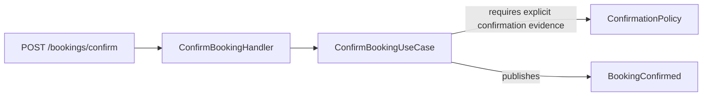
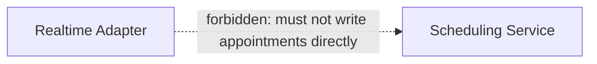
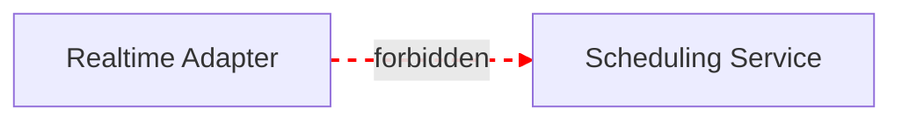
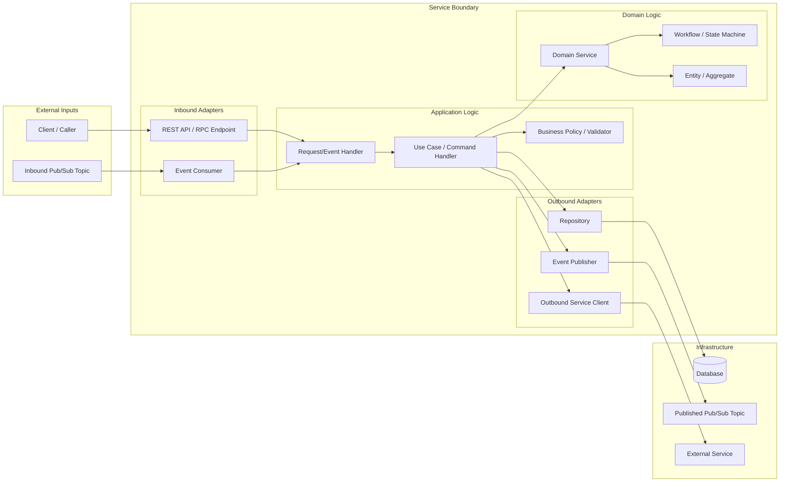

# Microservice Component & Event Flow Diagram

Use this skill to create a service-centered Mermaid diagram that explains how one microservice works internally and how it communicates through APIs and events.

The preferred artifact name is:

```text
Microservice Component & Event Flow Diagram
```

This is closest to a C4 component diagram adapted for event-driven microservices and ports-and-adapters architecture.

## Use This Skill When

Use this skill when the user asks for a Mermaid diagram that should show:

- the logical inner workings of a single microservice
- API endpoints and request handlers
- Pub/Sub, queue, webhook, or event consumers
- application use cases or command handlers
- business rules, policies, validation, authorization, or orchestration
- domain services, aggregates, entities, workflows, or state machines
- repositories, persistence, and database access
- outbound clients to other services or third-party APIs
- events emitted by the service
- ownership boundaries and forbidden paths

## Do Not Use This Skill When

Do not use this skill for:

- broad system architecture across many services
- infrastructure or deployment topology
- Kubernetes, Cloud Run, Terraform, or network diagrams
- database schema diagrams
- pure sequence diagrams
- runtime call traces unless the user specifically asks for step-by-step execution
- generic code documentation with no diagram requested

If the user wants runtime ordering, use a Mermaid `sequenceDiagram` instead. If the user wants deployment structure, use an infrastructure or deployment diagram instead.

## Core Rule

Create a Mermaid `flowchart` that shows what the service owns, how business logic flows internally, and how the service communicates through APIs, events, persistence, and outbound dependencies.

The diagram should make service boundaries explicit.

## Required Diagram Sections

Prefer these Mermaid subgraphs:

```text
External Inputs
Inbound Adapters
Application Logic
Domain Logic
Outbound Adapters
Persistence
Published Events
External Dependencies
Ownership Boundaries
```

Use only the sections that are relevant to the actual service.

## Recommended Flow

Model the service from left to right:

```text
External caller/event
  -> inbound adapter
  -> handler
  -> use case / command
  -> business rule / policy / workflow
  -> domain model / state machine
  -> repository / outbound client / event publisher
  -> database / external service / published topic
```

## Inspection Method

When generating the diagram from a codebase:

1. Identify the service boundary and primary responsibility.
2. Find inbound APIs, routes, controllers, request handlers, RPC handlers, webhooks, and event consumers.
3. Find application use cases, command handlers, orchestration services, policies, validators, and authorization checks.
4. Find domain components such as domain services, entities, aggregates, workflows, and state machines.
5. Find repositories, data stores, transaction boundaries, and persistence models.
6. Find outbound service clients, SDK calls, third-party API calls, and internal service calls.
7. Find published events, Pub/Sub topics, queues, event envelopes, and notification paths.
8. Identify forbidden paths or ownership violations, especially direct writes to another service's owned domain.
9. Do not invent APIs, events, dependencies, or ownership rules. If something is inferred but not proven, mark it as inferred or uncertain.

## Mermaid Rules

Use Mermaid `flowchart`, usually `flowchart LR`.

Prefer clear subgraphs over a flat graph.

Use concise node labels:

```text
ConfirmBookingUseCase
BookingPolicy
SchedulingClient
BookingConfirmedEvent
AppointmentRepository
```

Avoid excessive implementation noise such as every helper function, DTO, mapper, logger, or config constant unless it is architecturally important.

Use edge labels when they add meaning:



For forbidden or invalid ownership paths, use dotted edges or explicit labels:



When useful, add Mermaid styling for forbidden paths:



## Output Format

Unless the user asks for more, output:

1. a short diagram title
2. the Mermaid diagram
3. a brief notes section listing any assumptions, inferred items, uncertain items, or missing source evidence

Example:

````markdown
## Microservice Component & Event Flow Diagram



Notes:

- Mark uncertain dependencies as inferred.
- Do not include unverified APIs, topics, or service calls.
````

## Quality Bar

A good diagram should answer these questions quickly:

- What enters the service?
- Which handlers receive it?
- Which use cases own the business logic?
- Which domain rules or state machines matter?
- What data does the service persist or read?
- Which external services does it call?
- Which events does it publish?
- Which paths are explicitly forbidden?
- What does this service own versus delegate?

## Service Ownership Discipline

When the service participates in a larger microservice architecture, make ownership boundaries visible.

For example:

- A workflow service may own governed orchestration, but not the source of truth for availability.
- A scheduling service may own availability and appointment truth.
- A realtime adapter may invoke tools or APIs, but must not directly mutate another service's owned domain.
- An SDK may expose contracts, but must not invent domain truth.

Represent these rules directly in the diagram when they affect the service behavior.
