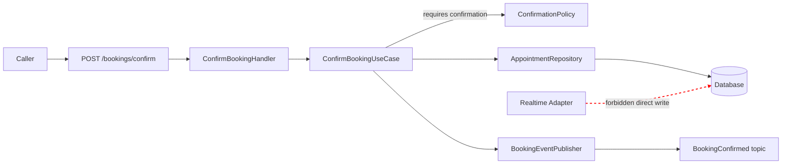

# Mermaid Authoring And Validation

Use this reference while authoring or validating a microservice component and
event-flow diagram.

## Layout

Prefer `flowchart LR` and use only relevant subgraphs:

```text
External Inputs
Service Boundary
  Inbound Adapters
  Application Logic
  Domain Logic
  Outbound Adapters
Infrastructure / Persistence
Published Events
External Dependencies
```

Use concise component labels and meaningful edge labels. Represent forbidden
ownership paths with dotted, labeled edges and optional red styling.



## Mermaid Rules

- Prefer nested subgraphs over a flat graph.
- Keep node IDs stable and labels concise.
- Add edge labels only when they clarify commands, events, rules, or ownership.
- Avoid every helper, DTO, mapper, logger, and config constant.
- Mark inferred dependencies in notes rather than presenting them as facts.
- Keep external authorities outside the service boundary.

## Validation

Use the repository-declared Mermaid command when present. Otherwise run:

```sh
mmdc -i <diagram.mmd> -o <temporary-output.svg>
```

Verify the output exists and is non-empty. Keep temporary output outside tracked
source unless a rendered artifact was requested. Correct every syntax or render
failure before handoff.

If no renderer or parser is available, report validation as skipped, name the
missing prerequisite, and provide the exact next command. Do not install
tooling automatically.
